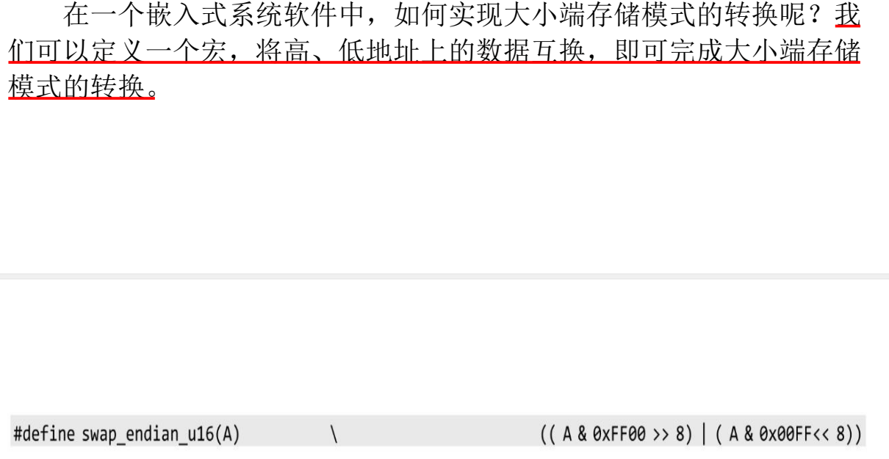
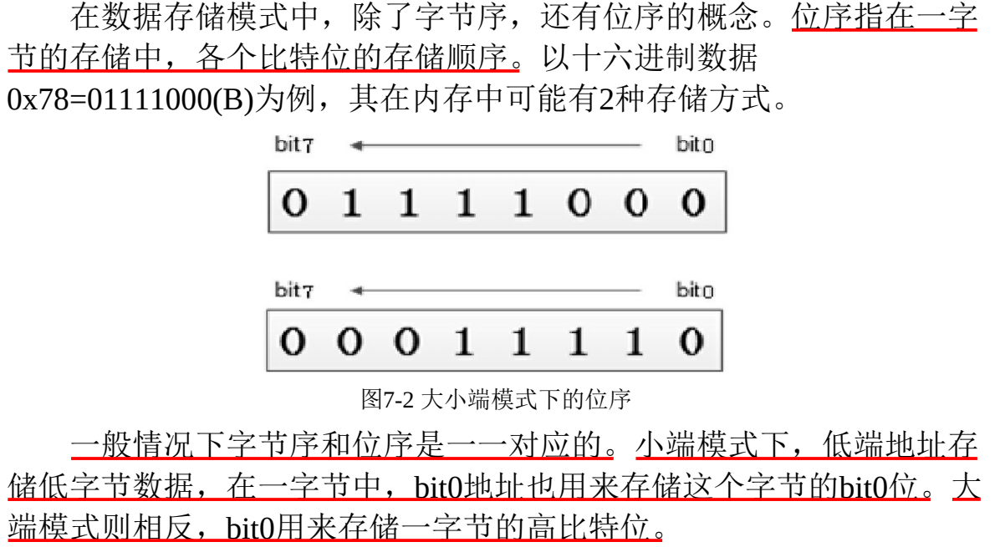
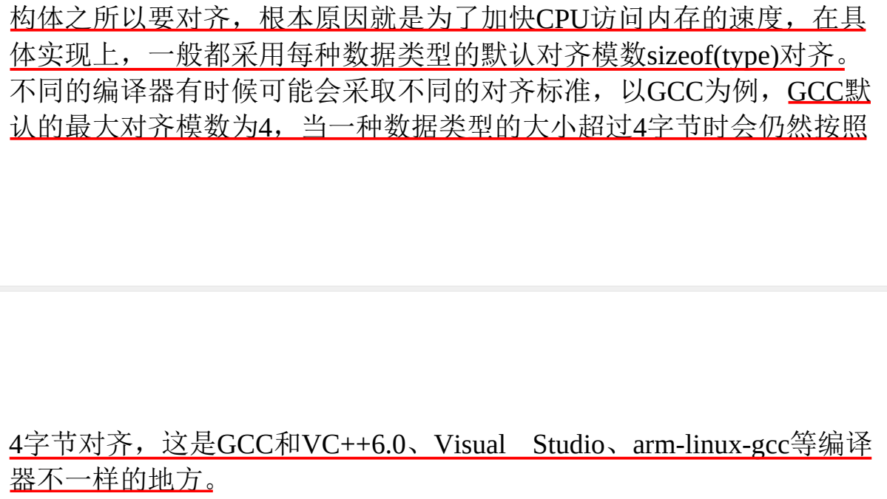
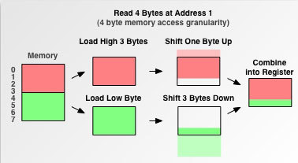
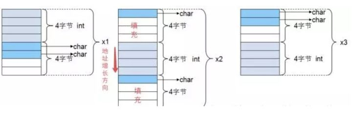
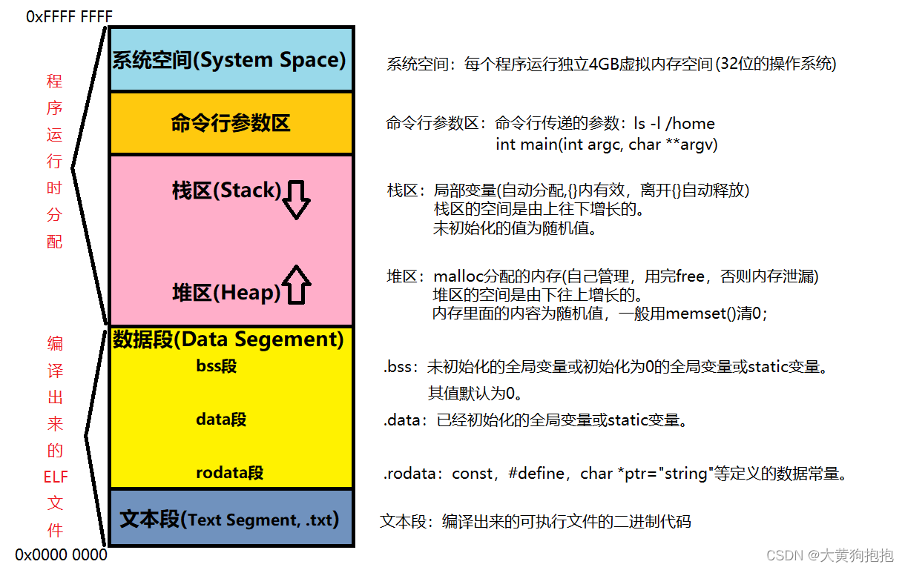
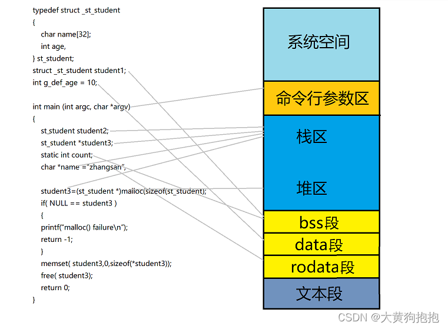

## C 内存分配


## static用法

### staic 修饰全局变量

staic修饰全局变量后，该变量只能在本文件中使用而不允许在其他文件中使用。这个全局变量被称为**静态全局变量（存放在数据段，静态局部变量也放在这里）**，你可以把它当作本文件的私有变量。

### static 修饰局部变量

static 修饰局部变量时，该变量称为静态局部变量，静态局部变量的存储空间在**静态存储区（数据段，全局变量也放在这里）**，与函数的堆栈区不在同一个区域，因此函数运行完毕后静态局部变量不会被释放。

静态局部变量只赋一次初值。下次使用静态局部变量的时候直接使用上次保存下来的值而不会重新赋值。

### staic 修饰函数

该函数只能被本文件的其他函数调用而不允许被其他文件的函数调用。这样的函数又叫作静态函数。使用静态函数的好处是，不用担心与其他文件的同名函数产生干扰，另外也是对函数本身的一种保护机制。


## strcpy、strncpy与memcpy的区别

strcpy、strncpy、memcpy这三个C语言函数在代码编写中会很频繁的使用到，但是三个函数的区别、使用时该注意什么还是有必要说下的。

本文参考《C 标准库》编写。

### 一、函数说明

#### 1、memcpy函数

```
void *memcpy(void *destin, void *source, unsigned n);
```

##### 说明：

函数memcpy从source指向的对象中复制n个字符到destin指向的对象中

##### 返回值：

函数memcpy返回destin的指针。

#### 2、strcpy函数

```
char strcpy(char dest, const char *src);
```

##### 说明：

函数strcpy把src指向的串（包括空字符）复制到dest指向的数组中，src和dest所指内存区域不可以重叠且dest必须有足够的空间来容纳src的字符串。

##### 返回值：

函数strcpy返回dest的指针。

#### 3、strncpy函数

```
char *strncpy(char *destinin, char *source, int maxlen);
```

##### 说明：

复制字符串source中的内容（字符，数字、汉字….）到字符串destinin中，复制多少由maxlen的值决定。source和destinin所指内存区域不可以重叠且destinin必须有足够的空间来容纳source的字符长度+'\0'。

##### 返回值：

函数strncpy返回destinin的值。

### 二、注意事项

1、strcpy 是依据 "\0" 作为结束判断的，如果 dest 的空间不够，则会引起 buffer overflow。

2、memcpy用来在内存中复制数据，由于字符串是以"\0"结尾的，所以对于在数据中包含"\0"的数据只能用memcpy。（通常非字符串的数据比如结构体都会用memcpy来实现数据拷贝）

3、strncpy和memcpy很相似，只不过它在一个终止的空字符处停止。当n>strlen(src)时，给dest不够数的空间里填充"\0“；当n<=strlen(src)时，dest是没有结束符"\0“的。这里隐藏了一个事实，就是dest指向的内存一定会被写n个字符。

4、strcpy只是复制字符串，但不限制复制的数量，很容易造成缓冲溢出。strncpy要安全一些。strncpy能够选择一段字符输出，strcpy则不能。

##### 所以总的来说注意：

1、dest指向的空间要足够拷贝；使用strcpy时，dest指向的空间要大于等于src指向的空间；使用strncpy或memcpy时，dest指向的空间要大于或等于n。

2、使用strncpy或memcpy时，n应该大于strlen(s1)，或者说最好n >= strlen(s1)+1；这个1 就是最后的“\0”。

3、使用strncpy时，确保s2的最后一个字符是"\0”。


## 大小端存储

#### 大小端存储模式转换

```cpp
#define swap_endian_u16(A) ((A & 0xFF00 >> 8) | (A & 0x00FF << 8))
```

> 

> 

> 


## 内存对齐

> 

> 

> 

> 

> 

> 

#### 内存对齐知识补充

当结构体中有数组时，数组的存储并非一个整体，而是拆分开的，可以将一个大数组看成并列的多个小部分。

```cpp
#include <stdio.h>

struct BBB {
  long num;        //4  8    7980
  char *name;      //8  8    7988
  short int data;  //2  2    7990   十六进制，满16进1
  char ha;         //1  2    7992
  short ba[5];     //10 10   7994  7996  7998  799A  799C  数组存储是拆分开的，可以看成五个short ba;
}p;                //最后，结构体在整体大小30的基础上补2，得32

int main()
{
    printf("%d  ", sizeof(p));
    printf("%p\n", &p);
    printf("%d   ", sizeof(p.num));
    printf("%p\n", &p.num);
    printf("%d   ", sizeof(p.name));
    printf("%p\n", &p.name);
    printf("%d   ", sizeof(p.data));
    printf("%p\n", &p.data);
    printf("%d   ", sizeof(p.ha));
    printf("%p\n", &p.ha);
    printf("%d  ", sizeof(p.ba));
    printf("%p\n", &p.ba[0]);
    printf("%p\n", &p.ba[1]);
    printf("%p\n", &p.ba[2]);
    printf("%p\n", &p.ba[3]);
    printf("%p\n", &p.ba[4]);
    return 0;
} 
```

> 

内嵌结构体的存储方式与数组类似。

```cpp
#include <stdio.h>
struct AAA {
    int ss;       //4  8   79A0
    double as;    //8  8   79A8
    int bb;       //4  8   79B0
}s;               //24 

struct BBB {
  long num;        //4  8    7980
  char *name;      //8  8    7988
  short int data;  //2  2    7990   十六进制，满16进1
  char ha;         //1  2    7992
  short ba[5];     //10 12   7994  7996  7998  799A  799C  数组存储是拆分开的，可以看成五个short ba;
  struct AAA d;    //24 24   79A0
}p;                //最后，结构体整体大小为32+24=56，已经对齐，不用补

int main()
{
    printf("%d  ", sizeof(p));
    printf("%p\n", &p);
    printf("%d   ", sizeof(p.num));
    printf("%p\n", &p.num);
    printf("%d   ", sizeof(p.name));
    printf("%p\n", &p.name);
    printf("%d   ", sizeof(p.data));
    printf("%p\n", &p.data);
    printf("%d   ", sizeof(p.ha));
    printf("%p\n", &p.ha);
    printf("%d  ", sizeof(p.ba));
    printf("%p\n", &p.ba[0]);
    printf("%d  ", sizeof(p.d));
    printf("%p\n", &p.d);
    ////////////////////////////
    printf("%d  ", sizeof(p.d.ss));
    printf("%p\n", &p.d.ss);
    printf("%d  ", sizeof(p.d.as));
    printf("%p\n", &p.d.as);
    printf("%d  ", sizeof(p.d.bb));
    printf("%p\n", &p.d.bb);
    // printf("%p\n", &p.ba[1]);
    // printf("%p\n", &p.ba[2]);
    // printf("%p\n", &p.ba[3]);
    // printf("%p\n", &p.ba[4]);
    return 0;
} 
```

> 


#### 1、什么是内存对齐

- 现代计算机中内存空间都是按照 byte 划分的，从理论上讲似乎对任何类型的变量的访问可以从任何地址开始，但是实际的计算机系统对基本类型数据在内存中存放的位置有限制，它们会**要求这些数据的首地址的值是某个数k（通常它为4或8）的倍数，这就是所谓的内存对齐**。

#### 2、为什么要进行内存对齐

- 尽管内存是以字节为单位，但是大部分处理器并不是按字节块来存取内存的.它一般会以双字节,四字节,8字节,16字节甚至32字节为单位来存取内存，我们将上述这些存取单位称为**内存存取粒度**.

  - 现在考虑4字节存取粒度的处理器取int类型变量（32位系统），该处理器只能从地址为4的倍数的内存开始读取数据。

  - 假如没有内存对齐机制，数据可以任意存放，现在一个int变量存放在从地址1开始的联系四个字节地址中，该处理器去取数据时，要先从0地址开始读取第一个4字节块,剔除不想要的字节（0地址）,然后从地址4开始读取下一个4字节块,同样剔除不要的数据（5，6，7地址）,最后留下的两块数据合并放入寄存器.这需要做很多工作.

  - 现在有了内存对齐的，int类型数据只能存放在按照对齐规则的内存中，比如说0地址开始的内存。那么现在该处理器在取数据时一次性就能将数据读出来了，而且不需要做额外的操作，提高了效率。

    > 

#### 3、内存对齐规则

- 每个特定平台上的编译器都有自己的默认“对齐系数”（也叫对齐模数）。gcc中默认#pragma pack(4)，可以通过预编译命令#pragma pack(n)，n = 1,2,4,8,16来改变这一系数。

- 有效对齐值：==是给定值==#pragma pack(n)==和结构体中最长数据类型长度中较小的那个==。有效对齐值也叫**对齐单位**。

- 了解了上面的概念后，我们现在可以来看看内存对齐需要遵循的规则：

  - (1) 结构体第一个成员的**偏移量（offset）**为0，以后每个成员相对于结构体首地址的 偏移量 都是**该成员大小与有效对齐值中较小那个**的整数倍，如有需要编译器会在成员之间加上填充字节。

  - (2) **结构体的总大小**为 有效对齐值 的**整数倍**，如有需要编译器会在最末一个成员之后加上填充字节。

下面给出几个例子以便于理解：

```cpp
//32位系统
#include<stdio.h>
struct
{
    int i;    4
    char c1;  1
    char c2;  1
}x1;

struct{
    char c1;  1
    int i;    4
    char c2;  1
}x2;

struct{
    char c1;  1
    char c2;  1
    int i;    4
}x3;

int main()
{
    printf("%d\n",sizeof(x1));  // 输出8
    printf("%d\n",sizeof(x2));  // 输出12
    printf("%d\n",sizeof(x3));  // 输出8
    return 0;
}
```

以上测试都是在Linux环境下进行的，linux下默认#pragma pack(4)，且结构体中最长的数据类型为4个字节，所以有效对齐单位为4字节，下面根据上面所说的规则**以s2来分析其内存布局：**

- 首先使用规则1，对成员变量进行对齐：

  - sizeof(c1) = 1 <= 4(有效对齐位)，按照1字节对齐，占用第0单元；

  - sizeof(i) = 4 <= 4(有效对齐位)，相对于结构体首地址的偏移要为4的倍数，占用第4，5，6，7单元；

  - sizeof(c2) = 1 <= 4(有效对齐位)，相对于结构体首地址的偏移要为1的倍数，占用第8单元；

- 然后使用规则2，对结构体整体进行对齐：

  - s2中变量i占用内存最大占4字节，而有效对齐单位也为4字节，两者较小值就是4字节。因此整体也是按照4字节对齐。由规则1得到s2占9个字节，此处再按照规则2进行整体的4字节对齐，所以整个结构体占用12个字节。

  - 根据上面的分析，不难得出上面例子三个结构体的内存布局如下：

    > 

#### 4、真题解析

**题目**

```cpp
求32bit环境下以下结构体所占的字节数：
typedef struct test_struct
{
 char a;  
 short b;     
 char c;     
 int d;
 char e;
}test_struct;
```

**测试代码**

```cpp
#include <stdio.h>

typedef struct test_struct
{
 char a;   1  2
 short b;  2  2 
 char c;   1  4
 int d;    4  4
 char e;   1  4 
}test_struct;

int main(void)
{
 test_struct test_s;  

 printf("\n============================================\n");
 printf("test_s addr   = %#.8x\n", &test_s);
 printf("test_s.a addr = %#.8x\n", &test_s.a);
 printf("test_s.b addr = %#.8x\n", &test_s.b);
 printf("test_s.c addr = %#.8x\n", &test_s.c);
 printf("test_s.d addr = %#.8x\n", &test_s.d);
 printf("test_s.e addr = %#.8x\n", &test_s.e);
 printf("sizeof(test_s) = %d\n", sizeof(test_s));
 printf("============================================\n");

 return 0;
}
```

**运行结果**

> 

**详细分析**

在分析这个问题之前，我们先记住关于结构体内存对齐的三条原则：

（1）结构体变量的`起始地址`能够被其最宽的成员大小整除。

（2）结构体每个成员相对于`起始地址的偏移`能够被其`自身大小整除`，如果不能则`在前一个成员后面补充字节`。

（3）结构体总体大小能够`被最宽的成员的大小整除`，如不能则`在后面补充字节`。

分析这个问题我们就不考虑`编译器可以指定对齐大小`的情况了。在32bit环境中，一般默认的对齐大小是4。

下面我们根据这三条原则来分析，并得出如下示意图：


从这张图中我们应该可以很清晰地看出整个结构体变量的内存占用情况。

> 如果还看不明白的朋友可阅读下面的解释（有点啰嗦，已经看明白的就不用看了~）：
>
> 从上例的结果中，我们结构体变量test_s的起始地址为0x0028ff30，能够被其最宽的成员（int类型的d成员，占4个字节）整除，符合第（1）条原则。
>
> a成员的地址即为结构体变量的起始地址0x0028ff30，排在a后面的是short类型（两个字节）的b成员。
>
> 根据第（2）条规则，显然b的地址不能从0x0028ff31开始，则编译器会在b成员的前一个成员（a成员）后边补1个空白字节，即b的的地址为从0x0028ff32，符合规则（2）。
>
> b成员占两个字节，两个字节之后的地址为0x0028ff34，而c成员为char类型（1字节），则根据规则（2），c成员会存放至地址0x0028ff34处。
>
> c成员占1个字节，1个字节之后的地址为0x0028ff35，排在c后面的是int类型（4个字节）的d成员，显然不能满足规则（2）。
>
> 编译器会在d成员的前一个成员（c成员）后面进行字节填充，这里必须填充3个字节才能符合规则（2），此时d会存放至地址0x0028ff38处。
>
> d成员占4个字节，4个字节之后的地址为0x0028ff3c。根据规则（2），e成员可从该地址开始存放。
>
> 此时`a+空白字节+b+c+空白字节+d+e`所占的字节总数为13个字节，而结构体最宽的成员（int类型的d成员）所占字节数为4字节。
>
> 显然不能满足规则（3），编译器会在e成员后面填充3个字节。即整个结构体变量test_s所占的总字节数为16字节。
>

**实际应用**

**（1）用保留变量替代填充字节**

实际应用中我们可以上面的结构体变量改为：

```
typedef struct test_struct
{
 char a;  
 char reserve0;    /* 保留成员 */
 short b;     
 char c;     
 int d;
 char e;
 char reserve1[3]; /* 保留成员 */
}test_struct;
```

我们已经知道了编译器会自动给我们的结构体变量填充一些空白字节，这些填充字节我们是看不到的，是隐性的。

在结构体变量占用相同内存的情况下，我们**可以显性的表示出这些填充字节，即创建一些保留成员 。**

这样当我们需要给这个结构体添加一些成员时，我们可以把保留的成员替换为实际的成员。这样在一定程度下有利于我们节省内存空间。

**（2）调整结构体成员的位置**

从上面的分析中我们知道编译器会根据我们结构体成员的排列来进行空白字节填充以达到对齐的效果。

那么我们自己进行手动对齐一些成员，那就可以节省一些空间了。比如把上面的我们的test_struct结构体成员的顺序改为：

```
typedef struct test_struct
{
 char a;  
 char c; 
 short b;         
 int d;
 char e;
}test_struct;
```

则结构体变量test_s所占的字节数变为12字节，即：

> 

即比原来的16字节省下了4个字节。

虽然这点优化对于一般的嵌入式应用来说可能没什么必要，但是万一某一天真的需要在某些资源极其受限的嵌入式设备中开发应用，这就是可以优化的一点。


## 内存分配问题

#### 题目引入

```cpp
#include <stdio.h>  
int main(void)  
{     
    char a;  
	char *str = &a;  
    strcpy(str, "hello");  
    printf("%s\n", str);  
	return 0;  
}  
```

#### 本题解析

没有正确为str分配内存空间，将会发生异常。

问题出在将一个字符串复制进一个字符变量指针所指地址。

虽然编译的时候没有报错，但是在运行过程中，因为越界访问了未被分配的内存，而导致段错误。

#### 相关知识点

在处理与指针相关的问题时，首先需要搞明白的就是内存，因为指针操作的就是内存。


## 内存的分区 - 简单介绍

下面这两种说法本身没有优劣之分，具体的内存划分也跟编译器有很大的关系，因此这两种说法都是可以接受的，搞明白内存的分区之后，指针的使用才能够更更加的灵活。

### 内存的分区 - 5分区说法

> 

##### 1、BSS段( bss segment )

通常是指用来存放程序中未初始化的全局变量和静态变量的一块内存区域 。

这里注意一个问题:一般的书上都会说全局变量和静态变量是会自动初始化的,那么哪来的未初始化的变量呢?

变量的初始化可以分为显示初始化和隐式初始化,全局变量和静态变量如果程序员自己不初始化的话的确也会被初始化,那就是不管什么类型都初始化为0,**这种没有显示初始化的就是我们这里所说的未初始化**。==既然都是0那么就没必要把每个0存储起来,从而节省磁盘空间,这是BSS的主要作用。==

BSS是英文Block Started by Symbol的简称。BSS段属于静态内存分配。 

**BSS节不包含任何数据,只是简单的维护开始和结束的地址,即总大小。**

以便内存区能在运行时分配并被有效地清零。BSS节在应用程序的二进制映象文件中并不存在,即不占用磁盘空间而只在运行的时候占用内存空间 ,所以如果全局变量和静态变量未初始化那么其可执行文件要小很多。


##### 2、数据段(data segment)

**通常是指用来存放程序中已经初始化的全局变量和静态变量的一块内存区域。**

数据段属于静态内存分配,可以分为**只读数据段和读写数据段。**

**字符串常量等,一般都是放在只读数据段中。**


##### 3、代码段(code segment/text segment)

通常是指用来存放程序执行代码的一块内存区域。

这部分区域的大小在程序运行前就已经确定,并且内存区域通常属于只读, 某些架构也允许代码段为可写,即允许修改程序。

在代码段中,也有可能包含一些只读的常数变量,例如字符串常量等,但一般都是放在只读数据段中 。


##### 4、堆(heap)

堆是用于存放进程运行中**被动态分配的内存段**,它的大小并不固定,可动态扩张或缩减。

**当进程调用malloc等函数分配内存时,新分配的内存就被动态添加到堆上(堆被扩张);** 

当利用free等函数释放内存时,被释放的内存从堆中被剔除(堆被缩减)。


##### 5、栈 (stack)

**栈又称堆栈, 是用户存放程序临时创建的局部变量**,也就是说我们函数括弧“{}” 中定义的变量。

==但不包括static声明的变量,static意味着在数据段中存放变量。==

除此以外, 在函数被调用时,其参数也会被压入发起调用的进程栈中,并且待到调用结束后,函数的返回值也会被存放回栈中。

由于栈的先进先出特点,所以栈特别方便用来保存/恢复调用现场。

从这个意义上讲,我们可以把堆栈看成一个寄存、交换临时数据的内存区。


### 内存的分区 - 4分区说法

##### 1、堆区：

**由程序员手动申请，手动释放，若不手动释放，程序结束后由系统回收，生命周期是整个程序运行期间。**

使用malloc或者new进行堆的申请，堆的总大小为机器器的虚拟内存的大小。

说明：new操作符本质上是使用了malloc进行内存的申请，new和malloc的区别如下：

（1）malloc是C语言中的函数，而new是C++中的操作符。

（2）malloc申请之后返回的类型是void*，而new返回的指针带有类型。

（3）malloc只负责内存的分配而不会调用类的构造函数，而new不仅会分配内存，而且会自动调用类的构造函数。


##### 2、栈区：

由系统进行内存的管理。主要**存放函数的参数以及局部变量。**

在函数完成执行，系统自行释放栈区内存，不需要用户管理。

整个程序的栈区的大小可以在编译器器中由用户自行设定，VS中默认的栈区大小为1M，可通过VS手动更改栈的大。

64bits的Linux默认栈大小为10MB，可通过ulimit-s临时修改。


##### 3、静态存储区：

==静态存储区内的变量在程序编译阶段已经分配好内存空间并初始化。这块内存在程序的整个运行期间都存在，它主要存放静态变量、全局变量和常量。==

注意：
 （1）这里不区分初始化和未初始化的数据区，是因为静态存储区内的变量若不显示初始化，则编译器会自动以默认的方式进行初始化，

> 即静态存储区内不存在未初始化的变量。

（2）静态存储区内的常量分为常变量和字符串常量，一经初始化，不可修改。

> 静态存储内的常变量是全局变量，与局部常变量不不同，区别在于局部常变量存放于栈，实际可间接通过指针或者引用进行修改，而全局常变量存放于静态常量区则不可以间接修改。

（3）字符串常量存储在静态存储区的常量区，字符串常量的名称即为它本身，属于常变量。

（4）数据区的具体划分，有利于我们对于变量类型的理解。

> 不同类型的变量存放的区域不同。


##### 4、代码区：

存放程序体的二进制代码。比如我们写的函数，都是在代码区的。


## C程序内存布局 - 详细介绍

### 1、内存布局图



**注意：**

- 这个4GB大小的内存(0x0000 0000~0xFFFF FFFF)不是系统的内存，而是进程的`虚拟地址空间`。
- 用户所看到和接触的都是该虚拟地址，并不是实际的物理内存地址。
- 当一个程序被编译后，只有文本段和数据段。
- 程序被编译后的可执行程序放在硬盘里，叫程序。
- 程序运行后叫进程。
- 只有在真正访问一个地址的时候才建立这个地址的物理映射。


### 2、虚拟地址空间

- 当创建一个进程时，操作系统会为该进程分配一个`4GB的虚拟地址空间`。(以`32 位的操作系统`为例，一个指针长度是 4 字节，4字节指针的寻址能力是从(0x0000 0000~0xFFFF FFFF)。
- 每个进程都会有一个自己的 4GB 虚拟地址空间。这 4GB 的地址空间是“虚拟”的，并不是真实存在的。


### 3、内存分类

#### 文本段(代码段)

- 存放了程序代码的数据。
- 编译出来的可执行文件的二进制代码。
- 用来存放代码，如printf，+，=，等代码。

#### 数据段

##### 1）rodata段(文字常量区)

**定义：**

- rodata段(文字常量区)：只读数据段

**例：**

```c
int main()
{
	char *str = "hello";
	*(str+1) = 'a';  //str[1] = 'a';
}
结果：segmentation fault;  //报段错误
```

**解析：**
因为“hello”是常量，存放在`.rodata段`，不可改变。

**注意：**

- str在执行时才有内存，因为它在栈区。

##### 2）data段

**定义：**

- ==存放已经初始化的全局变量或static(静态)变量==
- ==只要程序运行，所有`.data区`的数据都会一直存在，直到程序终止。==

**例：**

```c
想知道一段程序运行的多少次，以下代码可行吗？
func()
{
	int total = 0;
	total++;
}
结果：不可行
```

**解析：**

- 因为total在栈区，每次调用都会重新分配一段内存空间，total的值就会不一样。

**正确的方法：**

```c
func()
{
	static int total = 0;
	total++;
}
```

**解析：**

- ==因为static是静态变量（在函数中定义的静态变量），静态变量放在`.data区`，total的值不会改变。==

##### 3）bss段

**定义：**

- ==存放未初始化的全局变量或初始化为0的全局变量或static变量。==
- ==未初始化的静态局部变量，其值为0。==
- 默认值为0。

#### 栈区

**定义：**

- 栈内存由编译器在程序编译阶段完成。
- 函数返回后该函数的栈空间消失，所以函数中返回局部变量的地址都是非法的。
- 栈区存放局部变量。
- 堆区的空间是`由下往上增长`的。
- 自动分配内存，{}内有效，离开{}自动释放。
- 未初始化的值为随机值。

#### 堆区

- 堆内存是在程序执行过程中分配的，用于存放进程运行中被动态分配的的变量。
- 函数返回这段内存不会消失。
- malloc分配的内存，自己管理，用完要free，否则内存泄漏。
- 堆区的空间足由下往上增长的。
- 内存里面的内容为随机值，一般用memset（）清0。
- malloc（）动态类型分配内存，在内存中分配一段内存使用。

**例：**

```c
#include <stdio.h>
#include<stdlib.h>
int main()
{
	char *ptr;
	
	ptr = malloc(10);  //分配10个字节内存空间
	memset(ptr, 0, 10); //memset()清0

	realloc(ptr 100);

	free(ptr);  
	p = NULL;
	 
}
123456789101112131415
```

- `free(p)`，是放弃了指针对这个内存的占用，放弃之后，内存的值会改写成随机值。但是`指针本身并没有被删除！指针仍然指向原来的那块内存！`因此在free掉指针后，还要把指针指向null，即`p = NULL`。

#### 命令行参数区

**定义：**

- 命令行传递的参数:Is -l /home
  `int main(int argc, char **argv)`
- 参数区放命令行传给main()函数的参数：argc，argv。

#### 系统空间

**定义：**

- 存放在整个内核的代码和所有的内核模块，用来内核空间执行 Linux 系统调用。

#### 总结

- **参数区，堆区，栈区，数据段**是用来`存放数据`的。


### 4、局部变量和全局变量

#### 局部变量

**定义：**

- 花括号内所有定义的变量是局部变量，只能在本花括号使用。

**例：**

```c
int main(void)
{
        int stack_var;
        const int rodata_var = 50;
        static int s_var;
        char *ptr = "hello world";
        char arr[] = "hello";
}
```

**未定义的局部变量**，其`值是随机值`。
**未初始化的静态局部变量**，其`值为0`。

#### 全局变量

**定义：**

- 在花括号外定义的变量，是全局变量。

**例：**

```c
#include <stdio.h>

int g_data_var = 20;
int g_bss_var;
static int s_bss_var;
```

- **已初始化的全局变量**，可以被`所有其他c文件或本C文件中的函数调用`，如果另一个c文件想调用全局变量，要用`extern声明`。
  **例：**

```c
extern int g_data_var;
```

- **未初始化的全局变量**，其`值为0`，可以被`所有其他c文件或本C文件中的函数调用`。
- **未初始化的静态全局变量**，其`值为0`，static关键字声明的函数或变量，只能被`本C文件调用`。


### 5、C程序内存分布图文例子



**解析：**

- student1：未初始化的全局变量，在bss段
- count：未初始化的static静态变量，在bss段
- g_def_age：已初始化的全局变量，在data段
- student2、`*student3`、`*name`：局部变量，在栈区
- malloc：这段动态内存空间在堆区分配
- “zhangsan”：常量在rodata段


