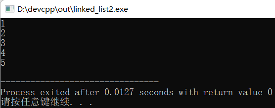

## 链表


链表是常用的数据结构，为方便学习，对链表进行细分，分为五种：

1、不带头节点的单链表
2、带头节点的单链表
3、不带头结点的双链表
4、带头结点的双链表
5、带头结点的双向循环链表

### 链表基本概念


**头指针：**

1. 头指针是指链表指向第一个结点的指针，若链表有头结点，则是指向头结点的指针
2. 头指针具有标识作用，所以常用头指针冠以链表的名字
3. 无论链表是否为空，头指针均不为空，头指针是链表的必要元素

**头节点：**

1. 头结点是为了操作的统一和方便而设立的，放在第一元素的结点之前，其数据域一般无意义(也可存放链表的长度)
2. 有了头结点，对在第一元素结点前插入结点和删除第一结点，其操作与其它结点的操作就统一了
3. 头结点不一定是链表必须要素

#### 单链表和双链表的区别


1. 单链表的每一个节点中只有指向下一个节点的指针，不能进行回溯。
2. 双链表的每一个节点中既有指向下一个节点的指针，也有指向上一个节点的指针，可以快速的找到当前节点的前一个节点。

实际中经常使用的一般为带头双向循环链表。

#### 单链表1

```c
#include<stdio.h>
#include<stdlib.h>

typedef struct node
{
 int data; //"数据域" 保存数据元素
 struct node * next; //保存下一个数据元素的地址
}Node;

void printList(Node *head){
    Node *p = head;
    while(p != NULL){
        printf("%d\n",p->data);
        p = p -> next;
    }
}

int main(){
  
  Node * a = (Node *)malloc(sizeof(Node));
  Node * b = (Node *)malloc(sizeof(Node));
  Node * c = (Node *)malloc(sizeof(Node));
  Node * d = (Node *)malloc(sizeof(Node));
  Node * e = (Node *)malloc(sizeof(Node));
  
  a->data = 1;
  a->next = b;
  
  b->data = 2;
  b->next = c;
  
  c->data = 3;
  c->next = d;
  
  d->data = 4;
  d->next = e;
  
  e->data = 5;
  e->next = NULL;
  
  printList(a);
}
```

结果：



这个链表比较简单，实现也很原始，只有创建节点和遍历链表，大家一看就懂！

#### 单链表2

这个链表功能多一点：

1. 创建链表
2. 创建节点
3. 遍历链表
4. 插入元素
5. 删除元素

```c
#include<stdio.h>
#include<stdlib.h>

typedef struct node
{
 int data; //"数据域" 保存数据元素
 struct node * next; //保存下一个数据元素的地址
}Node;

//创建链表，即创建表头指针 
Node* creatList()
{
 Node * HeadNode = (Node *)malloc(sizeof(Node));
 //初始化
 HeadNode->next = NULL;
 return HeadNode;
}

//创建节点 
Node* creatNode(int data)
{
 Node* newNode = (Node *)malloc(sizeof(Node));
 //初始化
 newNode->data = data;
 newNode->next = NULL;
 return newNode;
}

//遍历链表
void printList(Node *headNode){
    Node *p = headNode -> next;
    while(p != NULL){
        printf("%d\t",p->data);
        p = p -> next;
    }
    printf("\n");
}

//插入节点：头插法
void insertNodebyHead(Node *headNode,int data){
 //创建插入的节点 
    Node *newnode = creatNode(data);

    newnode -> next = headNode -> next;
    headNode -> next = newnode;
}

//删除节点
void deleteNodebyAppoin(Node *headNode,int posData){
 // posNode 想要删除的节点，从第一个节点开始遍历 
 // posNodeFront 想要删除节点的前一个节点 
    Node *posNode = headNode -> next;
    Node *posNodeFront = headNode;
    
 if(posNode == NULL)
  printf("链表为空，无法删除");
 else{
  while(posNode->data != posData)
  {
   //两个都往后移，跟着 posNodeFront 走 
   posNodeFront = posNode;  
   posNode = posNodeFront->next;
   if (posNode == NULL)
   {
    printf("没有找到，无法删除");
    return; 
   }
  }
  //找到后开始删除 
  posNodeFront->next = posNode->next;
  free(posNode);
 } 
}

int main(){
 
 Node* List = creatList();
 
 insertNodebyHead(List,1); 
 insertNodebyHead(List,2); 
 insertNodebyHead(List,3);  
 printList(List);
 
 deleteNodebyAppoin(List,2);
 printList(List);
 
 return 0;
}
```

结果：


大家从最简单的单链表开始，学习链表的增删改查，然后再学习双链表，最后学习双向循环链表。

#### 双向循环链表demo

```
#include<stdio.h>
#include<stdlib.h>

typedef struct node
{
 int data; //"数据域" 保存数据元素
 struct node * next; //保存下一个数据元素的地址
 struct node * prev; //保存上一个数据元素的地址
}Node;

//创建表头表示链表 
Node* creatList()
{
 Node * HeadNode = (Node *)malloc(sizeof(Node));
 //初始化，自己指向自己 
 HeadNode->next = HeadNode->prev = HeadNode;
 return HeadNode;
}
//创建节点 
Node* creatNode(int data)
{
 //C语言：malloc + free 
 //C++：new + delete 
 Node* newNode = (Node *)malloc(sizeof(Node));
 //初始化
 newNode->data = data;
 newNode->next = NULL;
 newNode->prev = NULL;
 return newNode;
}
//遍历链表
void printList(Node *headNode)
{
 //双向链表不光可以用 next 打印，也可以用 prev 进行打印
 //next指针打印：先进后出   
 //prev指针打印：先进先出 
    Node *p = headNode -> next;
    while(p != headNode){
        printf("%d\t",p->data);
        p = p -> next;
    }
    printf("\n");
}

//插入节点：头插法
void insertNodebyHead(Node *headNode,int data)
{
 //创建插入的节点 
    Node *newNode = creatNode(data);
 //注意顺序，赋值会改变指针指向，因此要先连后断 
 /*
 headNode -> next =  newnode;
 newnode -> prev = headNode;
 newnode -> next = headNode -> next;
 headNode ->next->prev = newNode;
 */
 // 从上面调整顺序，得到下面 
 newNode -> prev = headNode;
 newNode -> next = headNode -> next;
 headNode ->next->prev = newNode;
 headNode -> next =  newNode;
}

//插入节点：尾插法 
void insertNodebyTail(Node *headNode,int data)
{
 //创建插入的节点 
 Node *newNode = creatNode(data);
    
 //找到最后一个节点
 Node *lastNode = headNode;
 while(lastNode->next != headNode)
 {
  lastNode = lastNode->next;//往下走 
 }
 
 //注意顺序
 headNode->prev =  newNode;
 newNode->next = headNode;
 lastNode->next = newNode;
 newNode->prev = lastNode;

}

//删除节点
void deleteNodebyAppoin(Node *headNode,int posData)
{
 // posNode 想要删除的节点，从第一个节点开始遍历 
 // posNodeFront 想要删除节点的前一个节点 
    Node *posNode = headNode -> next;
    Node *posNodeFront = headNode;
    
 if(posNode == NULL)
  printf("链表为空，无法删除");
 else{
  while(posNode->data != posData)
  {
   //两个都往后移，跟着 posNodeFront 走 
   posNodeFront = posNode;  
   posNode = posNodeFront->next;
   if (posNode->next == headNode)
   {
    printf("没有找到，无法删除");
    return; 
   }
  }
  //找到后开始删除 
  posNodeFront->next = posNode->next;
  posNode->next->prev = posNodeFront;
  free(posNode);
 } 
}

int main()
{
 Node* List = creatList();
 
 insertNodebyHead(List,1); 
 insertNodebyHead(List,2); 
 insertNodebyHead(List,3);  
 printList(List);
 
 insertNodebyTail(List,0); 
 printList(List);
 
 deleteNodebyAppoin(List,2);
 printList(List);
 
 return 0;
}
```

结果：


双链表的创建、遍历和单链表差不多，只是头插法、尾插法、删除操作多了几个步骤。


